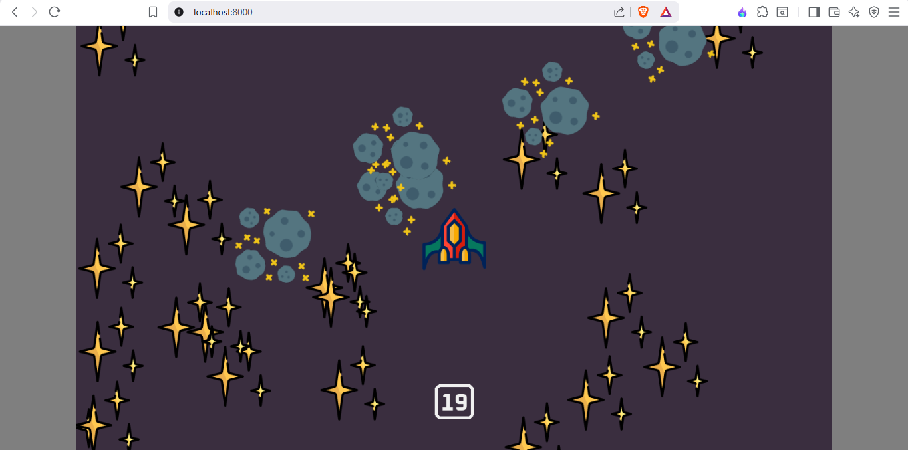

# Clash in Space

[](https://github.com/OWNER/REPO/actions/workflows/pygbag.yml)

A 2D space shooter game built with Python and designed to be played in a web browser.

## 🚀 Gameplay

While the exact gameplay mechanics are in the source code which was not provided, based on the assets it is a space-themed game that likely involves:

*   Shooting lasers at enemies.
*   Creating explosions upon impact.
*   An engaging soundtrack during gameplay.

## Screenshot



## 🛠️ Building for the Web

This project uses `pygbag` to build the Python code for a web-based environment (via Emscripten).

To build the project manually, you can use the following commands:

```bash
pip install pygbag
python -m pygbag --build main.py
```

This will create a `build/web` directory containing the necessary files to run the game in a browser.

## ⚙️ Continuous Deployment

The project is configured with a GitHub Actions workflow (`.github/workflows/pygbag.yml`) that automatically builds and deploys the game to GitHub Pages.

A push to the `main.py` file on the `main` branch will trigger the workflow, which builds the application and pushes the contents of the `build/web` directory to the `gh-pages` branch.